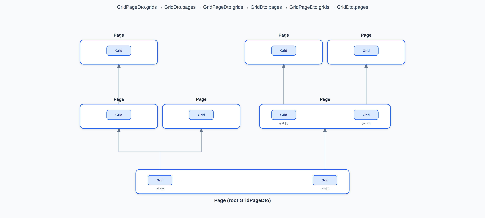

# App
SPA Application

# Folder Structure
- App.Server/api/ (API Endpoints)
- App.Server/dto/web/ (DTO objects shared with App.Web)
- App.Server/dto/server/ (DTO objects with Node-only fields, e.g. ObjectId)
- App.Server/util/ (Base functionality like app version and access to db and storage)
- App.Web/public/ (Static content)
- App.Web/src/page (Pages with a route path)

# SectorKey
- Global/ (System Status)
- Domain/my.com/Global/ (User, Project)
- Domain/my.com/Project/mystore1/ (File)

Note: Flag IsProject if true, access with login only.

# GridPage

# Tech Stack
App.Server
- TypeScript
- Vercel Serverless Functions

App.Web
- TypeScript
- React
- Vite (Build)

# Links
- https://claude.ai/code (AI)
- https://github.com/steinertech/App2 (Repo)
- https://vercel.com/ (Hosting)
- https://app2-9a9d-three.vercel.app (App)
- https://vscode.dev/ (Editor)

# TODO
- Folder App.Server/util [Done]
- Folder App.Web/src/page/ [Done]
- SectorKey find all "Domain" [Done]
- CORS util-main.ts corsHeaders